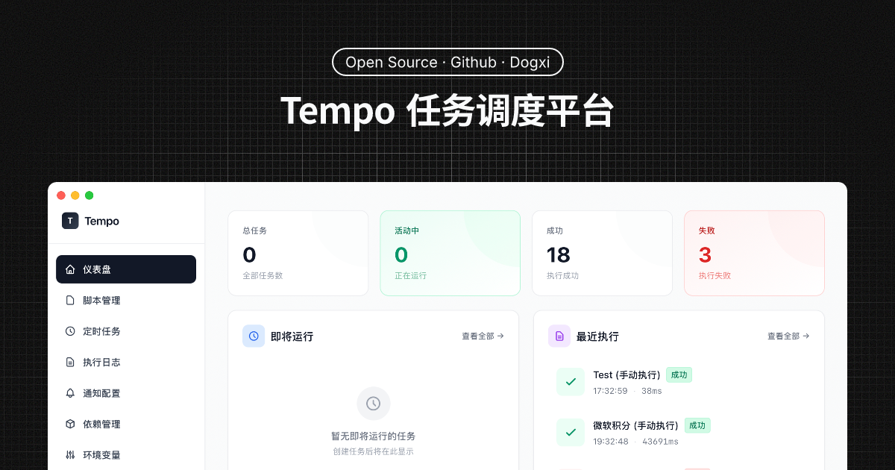

# Tempo - Alpha

<div align="left">
  
  
  
  
</div>

一个类青龙面板的跨平台定时任务管理应用，支持 Python、Node.js、Shell 脚本的定时执行和通知推送。



> [!WARNING]
> 仍在开发中，当前版本并不完整...

## ✨ 特性

- 🎯 **任务管理** - 创建、编辑、删除定时任务
- ⏰ **Cron 调度** - 支持标准 Cron 表达式，支持秒级调度
- 🐍 **多语言支持** - Python、Node.js、Shell 脚本
- 📝 **执行日志** - 完整的任务执行历史记录
- 🔔 **通知推送** - 支持钉钉、企业微信、Webhook 通知
- 🎨 **优雅界面** - 基于 Tailwind CSS 的现代化 UI
- 💾 **本地存储** - JSON 文件存储，无需数据库
- 🚀 **跨平台** - 支持 macOS、Windows、Linux

## 📦 安装

### 前置要求

- Go 1.23+
- Node.js 16+
- Wails CLI v2.11+

安装 Wails CLI:

```bash
go install github.com/wailsapp/wails/v2/cmd/wails@latest
```

### 构建

```bash
# 克隆项目
cd app

# 开发模式运行
wails dev

# 构建生产版本
wails build
```

构建完成后，可执行文件位于 `build/bin/` 目录。

## 🚀 快速开始

### 1. 创建任务

1. 点击「创建任务」按钮
2. 填写任务信息：
   - **任务名称**: 给任务起个名字
   - **任务描述**: 可选的详细说明
   - **脚本类型**: 选择 Python、Node.js 或 Shell
   - **脚本来源**: 可以选择文件路径或直接写代码

### 2. Cron 表达式示例

```
格式: 秒 分 时 日 月 周
或: 分 时 日 月 周

# 每分钟执行
* * * * *

# 每天 0 点执行
0 0 * * *

# 每周一 9:00 执行
0 9 * * 1

# 每 5 分钟执行
*/5 * * * *

# 每天 8:00、12:00、18:00 执行
0 8,12,18 * * *
```

### 3. 脚本示例

#### Python 脚本

```python
#!/usr/bin/env python3
import datetime

print(f"Hello from Python! Current time: {datetime.datetime.now()}")
```

#### Node.js 脚本

```javascript
#!/usr/bin/env node
console.log(`Hello from Node.js! Current time: ${new Date().toISOString()}`);
```

#### Shell 脚本

```bash
#!/bin/bash
echo "Hello from Shell! Current time: $(date)"
```

### 4. 配置通知

1. 进入「通知配置」页面
2. 点击「添加通知」
3. 选择通知类型（飞书/钉钉/企业微信/Webhook）
4. 填写对应的配置信息

#### 飞书机器人

1. 在飞书群中添加自定义机器人
2. 获取 Webhook URL
3. 粘贴到 Tempo 配置中

#### 钉钉机器人

1. 在钉钉群中添加自定义机器人
2. 获取 Webhook URL
3. 粘贴到 Tempo 配置中

#### 企业微信机器人

1. 在企业微信群中添加机器人
2. 获取 Webhook URL
3. 粘贴到 Tempo 配置中

#### 自定义 Webhook

Tempo 会发送 POST 请求，JSON 格式：

```json
{
  "id": "log_xxx",
  "taskId": "task_xxx",
  "taskName": "我的任务",
  "startTime": "2024-11-24T15:00:00Z",
  "endTime": "2024-11-24T15:00:05Z",
  "duration": 5000,
  "output": "任务输出内容",
  "error": "",
  "success": true
}
```

## 📂 项目结构

```
tempo/
├── internal/              # 核心业务逻辑
│   ├── executor/         # 脚本执行器
│   ├── models/           # 数据模型
│   ├── notifier/         # 通知系统
│   ├── scheduler/        # 任务调度器
│   └── storage/          # 数据存储
├── frontend/             # React 前端
│   ├── src/
│   │   ├── components/  # 组件
│   │   ├── pages/       # 页面
│   │   └── types/       # 类型定义
│   └── wailsjs/         # Wails 生成的绑定
├── app.go               # 应用主逻辑
└── main.go              # 入口文件
```

## 💾 数据存储

数据存储在用户主目录的 `.tempo` 文件夹：

```
~/.tempo/
├── tasks.json           # 任务配置
├── logs.json            # 执行日志
├── configs.json         # 通知配置
└── scripts/             # 脚本文件
```

## 🛠️ 技术栈

### 后端

- **Wails v2** - Go + Web 技术的桌面应用框架
- **robfig/cron** - Cron 表达式解析和调度
- **Go 标准库** - 文件操作、进程执行等

### 前端

- **React 18** - UI 框架
- **TypeScript** - 类型安全
- **Tailwind CSS** - 样式框架
- **Vite** - 构建工具

## 📝 开发

### 前端开发

```bash
cd frontend
npm install
npm run dev
```

### 后端开发

```bash
# 重新生成绑定
wails generate module

# 热重载开发
wails dev
```

### 添加依赖

```bash
# Go 依赖
go get github.com/example/package

# npm 依赖
cd frontend
npm install package-name
```

## 🔧 配置

### 修改窗口大小

编辑 `main.go`:

```go
Width:  1280,  // 窗口宽度
Height: 800,   // 窗口高度
```

### 修改数据目录

编辑 `app.go` 的 `startup` 方法:

```go
a.dataDir = filepath.Join(homeDir, ".tempo")
```

## 🐛 故障排除

### Python/Node.js 未找到

确保系统 PATH 中包含 `python3` 和 `node` 命令：

```bash
# 检查
which python3
which node

# macOS/Linux 添加到 PATH
export PATH="/usr/local/bin:$PATH"
```

### 权限错误

脚本文件需要执行权限：

```bash
chmod +x /path/to/script.sh
```

### 日志过多

定期清理日志文件：

```bash
rm ~/.tempo/logs.json
```

或在代码中限制日志数量（`storage/storage.go`）。

## 📄 许可证

MIT License

## 🙏 致谢

- [Wails](https://wails.io/) - 优秀的 Go 桌面应用框架
- [青龙面板](https://github.com/whyour/qinglong) - 灵感来源
- [Tailwind CSS](https://tailwindcss.com/) - 美观的 CSS 框架

## 🤝 贡献

欢迎提交 Issue 和 Pull Request！

1. Fork 本仓库
2. 创建特性分支 (`git checkout -b feature/AmazingFeature`)
3. 提交更改 (`git commit -m 'Add some AmazingFeature'`)
4. 推送到分支 (`git push origin feature/AmazingFeature`)
5. 开启 Pull Request

## 📮 联系方式

- Email: hi@dogxi.me
- GitHub: [@dogxi](https://github.com/dogxi)

## 🎨 macOS 优化

Tempo 针对 macOS 进行了特别优化：

- **无边框标题栏** - 使用 macOS 原生的 Inset 标题栏样式
- **简洁设计** - 移除了应用图标，保持界面简约
- **原生体验** - 完美集成 macOS 交通灯按钮
- **拖拽支持** - Header 区域支持窗口拖拽

---

⭐ 如果这个项目对你有帮助，请给个 Star！
